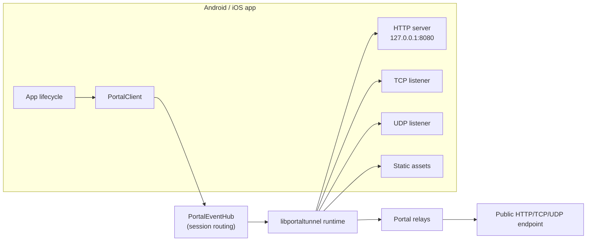

<p align="center">
  
</p>

<h1 align="center">Portal Multiplatform SDK</h1>

<p align="center">
  Expose app-local <b>HTTP</b> servers, <b>TCP/UDP</b> sockets, and static
 assets from Android, iOS, and desktop (JVM) through
  <a href="https://github.com/gosuda/portal-tunnel">Portal</a> relays.
</p>

<p align="center">
  <a href="https://github.com/gosuda/portal-multiplatform-sdk/actions/workflows/gradle.yml"></a>
  
  
  <a href="LICENSE"></a>
</p>

---

## What you can build with it

Portal gives software running inside an Android, iOS, or desktop app a public endpoint —
no public IP or port forwarding required:

- **On-device APIs and webhooks** — expose a Ktor, NanoHTTPD, or other
  loopback HTTP server for callbacks, integrations, and device-local APIs.
- **Mobile game and peer services** — publish TCP or UDP listeners for
  multiplayer sessions, co-op lobbies, and custom protocols.
- **Dev tunnels** — reach an app's local service from remote QA, demos, or
  development tooling.
- **Route-based applications** — send different URL prefixes to local HTTP
  upstreams or bundled assets, with optional x402 pricing per route.
- **Static applications** — publish files directly when running an embedded
  HTTP server would add unnecessary weight.
- **Privacy-aware endpoints** — use ECH, unlisted discovery, and MITM
  self-probing across multiple relays.

## What it does

This SDK is a mobile tunnel runtime around `libportaltunnel`. `PortalConfig`
describes which app-local service to expose; `PortalClient` owns its tunnel
sessions and reports their authoritative state:

- **HTTP/TLS upstreams and routes** proxy requests to loopback servers running
  in the app process.
- **Raw TCP and UDP tunnels** expose app-owned sockets and custom protocols.
- **Static directories** are a convenience mode, not a required architecture.
- **One lifecycle API** covers relay discovery, ECH privacy, x402 payments,
  structured failures, and explicit session ownership.
- **`StateFlow` snapshots** are authoritative; bounded events are auxiliary
  notifications.

## Exposure modes

| App-local source | `PortalConfig` shape | Typical use |
|---|---|---|
| HTTP server | `targetAddr = "127.0.0.1:8080"` | APIs, webhooks, dev servers |
| HTTP routes | `httpRoutes = listOf(...)` | Prefix routing, mixed upstreams, x402 |
| TCP listener | `tcp = true` | Custom protocols, game sessions |
| UDP listener | `udp = true, udpAddr = "127.0.0.1:7777"` | Real-time and datagram protocols |
| Static directory | `staticDir = dir` | Serverless assets and bundled web UIs |

## Architecture



| Layer | Where | Contract |
|---|---|---|
| `PortalClient` / `PortalTunnel` | `commonMain` | configuration, snapshots, failures, ownership |
| `PortalEventHub` | `commonMain` | one native callback → correct session owner |
| `PortalNativeEngine` | platform adapters | raw string/JSON ABI seam |
| JNI bridge | `portal-native-android` | `org.gosuda.portal.android.internal.NativeBridge` |
| cinterop | `nativeMain` | `portaltunnel.def` → `native/include/portaltunnel.h` |
| Swift facade | `iosMain` | `PortalIosClient` / `PortalIosSession` callbacks |

## Platform matrix

| Target | Status | Native engine |
|---|---|---|
| `android` (arm64-v8a, x86_64) | ✅ shipped | JNI `libportaltunnel.so` built reproducibly from `native/bridge`, 16 KB-page aligned |
| `iosArm64` / `iosSimulatorArm64` / `iosX64` | ✅ shipped | matching `libportaltunnel.a` embedded in each published KMP klib/XCFramework slice |
| `desktop` (JVM 17+, linux-x64 / windows-x64 / macos-universal) | ✅ shipped | `libportaltunnel` shared library packaged in `portal-native-desktop`, loaded via JNA |
| `linuxX64` | 🧪 experimental | C stub for tests; link the real `.so` for production |

## Install

Application builds consume the SDK from Maven Central:

```kotlin
dependencies {
    implementation("io.github.gosuda:portal-sdk:0.1.0")
}
```

Android apps that use the optional process/lifecycle helpers also add:

```kotlin
implementation("io.github.gosuda:portal-android-lifecycle:0.1.0")
```

API references: [Kotlin (Dokka)](https://github.com/gosuda/portal-multiplatform-sdk/releases/latest/download/dokka-html.zip)
· [Swift](docs/SWIFT_API.md) — generated from the shipped artifacts.

The samples consume the intended Maven coordinates rather than `project()`
dependencies. Android JNI libraries are built directly from this repository's
MIT-licensed `native/bridge` with Go and Android NDK r29 during
`portal-native-android` assembly/publication; no external `.so` is downloaded
or republished. To verify an unpublished checkout through an isolated Maven
repository:

```bash
./gradlew publishDesktopSdkToSampleRepository
./gradlew :samples:desktop:build \
  -Pportal.samples.repository="$PWD/build/sample-maven"

# Requires an installed Android SDK:
./gradlew publishAndroidSdkToSampleRepository
./gradlew :samples:android:assembleDebug \
  -Pportal.samples.repository="$PWD/build/sample-maven"
```

iOS KMP variants embed the matching Go engine archive and propagate required
Security framework linkage. Swift consumers use the self-contained
`PortalSDK.xcframework`/Swift package produced by
`scripts/package-ios-xcframework.sh`; neither consumer path requires building
or manually linking `libportaltunnel.a`.

Desktop (JVM) resolves the `portal-sdk-desktop` variant plus the
`portal-native-desktop` runtime JAR transitively — no extra dependency or
native install step. The engine is extracted to a content-addressed cache on
first use and works offline.


## Quick start: expose a local HTTP server

Start your HTTP server on a loopback address, then publish it:

### Kotlin (Android / common)

```kotlin
val client = PortalClient(applicationContext)

// Opens the tunnel, waits until it is ACTIVE, and rolls back on failure.
val tunnel = client.publish(
    PortalConfig.http("127.0.0.1:8080", name = "device-api")
)

println(tunnel.publicUrl)   // first public URL; live updates stay on tunnel.state

tunnel.stop()      // retryable on native failure
client.close()     // stops only the sessions this client owns
```

`publish` is the easy path: it returns only after the tunnel reports ACTIVE
and stops the session if readiness fails. Use `open` when you need
accepted-before-ready semantics — e.g. to render CONNECTING or await a single
capability:

```kotlin
val tunnel = client.open(PortalConfig.http("127.0.0.1:8080"))
tunnel.state.collect { snapshot ->
    println("${snapshot.phase} ${snapshot.primaryPublicUrl}")
}
val ready = tunnel.awaitReady(Capability.HTTP_TLS)
// or: tunnel.awaitActive(15_000)
```


### Kotlin (Desktop / JVM)

```kotlin
// Resolves the packaged native engine and a per-OS identity path.
val client = PortalDesktop.client("com.example.myapp")

val tunnel = client.publish(
    PortalConfig.http("127.0.0.1:8080", name = "desktop-api")
)
println(tunnel.publicUrl)

tunnel.stop()
client.close()
```

`PortalDesktop.client(applicationId)` loads the verified `libportaltunnel`
from the `portal-native-desktop` runtime JAR (extracted to a
content-addressed cache) and defaults `identity_path` to a per-OS location:
`$XDG_STATE_HOME/<app>/portal` on Linux, `%LOCALAPPDATA%/<app>/Portal` on
Windows, `~/Library/Application Support/<app>/Portal` on macOS. Pass
`storageDirectory` or `nativeLibraryPath` to override. See
[samples/desktop](samples/desktop) for the Compose app — a Publish /
Settings / Activity UI mirroring the Android sample (Snake game, explainer,
Ollama on-device model, Minecraft ping) — plus headless
`:samples:desktop:smoke` and `:samples:desktop:ondeviceSmoke` checks.

### Swift (iOS)

```swift
let client = PortalIosClient(allowRemoteTargets: false, defaultIdentityPath: nil)
let config = PortalIosConfigFactory.shared.http(
    targetAddress: "127.0.0.1:8080", name: "device-api"
)
operation = client.publish(config: config, timeoutMillis: 30_000) {
    session, failure in
    // session?.primaryPublicUrl, or a structured PortalFailure
}
```

The Android and iOS sample apps use static assets because that makes the demo
self-contained. Static serving is optional; the same lifecycle API owns HTTP,
TCP, and UDP tunnels.

See [samples/android](samples/android) for the complete Compose app and
[samples/ios](samples/ios) for the SwiftUI equivalent. The full Swift call
surface is documented in [docs/SWIFT_API.md](docs/SWIFT_API.md).


## Usage

### Configuration

`PortalConfig` selects the app-local service and optional relay features.
Intent factories cover the common exposure modes; the raw constructor and
`PortalConfig.Builder` remain for advanced combinations:

```kotlin
// Proxy a local HTTP server
PortalConfig.http("127.0.0.1:8080", name = "api")

// Route prefixes to one or more local HTTP services
PortalConfig.routes(
    listOf(
        PortalHTTPRoute(prefix = "/api", upstream = "http://127.0.0.1:8080"),
        PortalHTTPRoute(prefix = "/admin", upstream = "http://127.0.0.1:9090")
    ),
    name = "routes"
)

// Raw TCP / UDP listeners
PortalConfig.tcp(name = "tcp-service")
PortalConfig.udp("127.0.0.1:7777", name = "game")

// Static assets without an embedded HTTP server
PortalConfig.staticSite(dir, index = "index.html", name = "site")

// Advanced: raw constructor for combinations the factories don't cover
PortalConfig(name = "private", discovery = false,
             relays = listOf("https://portal.example.com"))

// Paid route (x402)
PortalConfig(
    name = "paid",
    httpRoutes = listOf(
        PortalHTTPRoute(prefix = "/premium", upstream = "http://127.0.0.1:8080",
                        amount = "0.01")
    ),
    x402 = PortalX402Config(payTo = "0x…", network = "sui", asset = "USDC")
)
```

Key rules: `identity_json` XOR `identity_path`; `discovery=false` needs ≥1
relay; relays are `https`-only (`http` allowed for loopback); targets are
loopback-only unless `PortalClient(allowRemoteTargets = true)`.

### Lifecycle & ownership

- One `PortalClient` per app (or long-lived component). It owns every
  `PortalTunnel` it opens.
- `client.publish(config)` returns only after the tunnel reports ACTIVE and
  stops the session if readiness fails — the easy path for "give me a URL".
- `client.open(config)` returns once the native runtime accepted the start;
  readiness is observed via `state`/`awaitReady`/`awaitActive`.
- `client.close()` stops exactly the sessions it owns — never another
  client's. Safe to call twice; concurrent calls serialize.
- `tunnel.stop()` is idempotent and retryable: a native failure leaves the
  session in `STOPPING`, not `STOPPED`.
- Cancelling `open` or `publish` rolls the native handle back — no orphaned
  sessions.

### Observing state

```kotlin
// Authoritative snapshot — render this in UI.
tunnel.state.collect { snap ->
    snap.phase               // IDLE → STARTING → CONNECTING → ACTIVE → …
    snap.primaryPublicUrl    // first public URL, if any
    snap.relays              // per-relay state/failure/error
    snap.hasSecurityWarning  // sticky MITM flag
    snap.isActive / isTerminal
}

// Auxiliary events (bounded, not replayed).
tunnel.events.collect { event -> /* Started / StatusChanged / … */ }

// Aggregate stream across all sessions this client owns.
client.events.collect { event -> … }

// Live session list (open order).
client.sessions.collect { list -> … }
```

### Live updates without restart

```kotlin
tunnel.updateMetadata(PortalMetadata(description = "new", tags = listOf("x")))
tunnel.addRelay("https://portal.example.com")
tunnel.removeRelay("https://portal.example.com")
tunnel.refresh()   // pull authoritative native status now
```

### Identity

```kotlin
val identity = PortalIdentity.generate("my-app")   // native-generated keys
val restored = PortalIdentity.parse(savedJson)      // validate + redacted toString
config = PortalConfig(identityJson = identity.document, ...)
// or let the engine persist one:
PortalConfig(identityPath = File(filesDir, "identity.json").absolutePath, ...)
```

`PortalIdentity.document` contains key material — redacted from `toString`;
store it in Keystore-wrapped storage / Keychain, never log it.

When a config sets neither `identityJson` nor `identityPath`, the SDK supplies
a platform-owned default: `filesDir/identity.json` on Android (via
`PortalClient(context)`), `Application Support/Portal/identity.json` on iOS,
and a per-OS application directory on desktop (via `PortalDesktop.client`).

### Kotlin DSL + Android Context

```kotlin
val config = portalConfig {
    setName("device-api")
    setTargetAddress("127.0.0.1:8080")
    setDiscovery(true)
}

// Android: defaults identity_path to filesDir/identity.json
val client = PortalClient(context)
```

### Android: surviving background & rotation

`portal-android-lifecycle` keeps a tunnel alive past the screen:

```kotlin
// Application.onCreate
PortalClientHolder.init(this)

// Foreground service for tunnels that must run while backgrounded
class TunnelService : PortalTunnelService() {
    override fun buildNotification(): Notification = …
}
// manifest: <service android:name=".TunnelService"
//   android:foregroundServiceType="dataSync"/>
```

### Diagnostics

```kotlin
val d = client.diagnostics()
// d.sdkVersion, d.engineVersion, d.abiVersion, d.activeSessions,
// d.droppedOrphanEvents, d.droppedAggregateEvents, d.sessions[]
// per session: phase, revision, droppedEvents, activeRelay, lastFailure
```

Diagnostics never contain identity documents, keys, tokens, or request
bodies — safe to attach to a bug report.

### Managed lifetime

One owner per tunnel lifetime; each pattern stops only sessions that owner
created:

```kotlin
// JVM / desktop / common: scope-bound use{} — close() runs even on failure.
PortalDesktop.client("com.example.myapp").use { client ->
    val tunnel = client.publish(PortalConfig.http("127.0.0.1:8080"))
    println(tunnel.publicUrl)
}   // client.close() stops only its own sessions

// Android: process-owned client + ready-on-return callback.
PortalClientHolder.init(this)   // Application.onCreate
PortalClientHolder.publish(PortalConfig.http("127.0.0.1:8080")) { result ->
    result.onSuccess { println(it.publicUrl) }
}
// Backgrounded tunnels: subclass PortalTunnelService (foreground service).
```

```swift
// iOS: the client owns sessions; close tears down only its own.
let client = PortalIosClient(allowRemoteTargets: false, defaultIdentityPath: nil)
let op = client.publish(config: config, timeoutMillis: 30_000) { s, f in … }
op.cancel()          // cancels the in-flight publish; completion never fires
client.close { _ in } // stops every session this client opened
```

### Structured publish failures

`publish` failures are typed — no message parsing needed:

```kotlin
try {
    client.publish(config)
} catch (e: PortalException) {
    val f = e.failure
    f.code              // STOP_TIMEOUT, TUNNEL_CLOSED, INVALID_CONFIG, …
    f.operation         // "publish" or "publish_cleanup"
    f.retryable         // safe to retry the operation
    f.terminalPhase     // FAILED/STOPPED when the session ended first
    f.readinessFailure  // the readiness error when cleanup itself failed
}
```

The same fields reach Swift through `PortalFailure` — `failure.operation`,
`failure.retryable`, `failure.terminalPhase`, `failure.readinessFailure`.


## Recipes

### Expose a TCP listener (game server, custom protocol)

```kotlin
val tunnel = client.publish(PortalConfig.tcp(name = "minecraft"))
// The relay hands out a TCP endpoint; read it from the relay status:
tunnel.state.value.relays.firstOrNull()?.tcpAddr
```

### Expose a UDP listener

```kotlin
val tunnel = client.publish(PortalConfig.udp("127.0.0.1:7777", name = "voice"))
tunnel.state.value.relays.firstOrNull()?.udpAddr
```

### Route URL prefixes to different local services

```kotlin
val tunnel = client.publish(
    PortalConfig.routes(
        listOf(
            PortalHTTPRoute(prefix = "/api", upstream = "http://127.0.0.1:8080"),
            PortalHTTPRoute(prefix = "/", staticRoot = siteDir.absolutePath)
        ),
        name = "app"
    )
)
```

### Publish a directory without an HTTP server

```kotlin
val tunnel = client.publish(
    PortalConfig.staticSite(dir.absolutePath, index = "index.html", name = "site")
)
```

### Keep an Android tunnel alive in the background

Android kills background processes; a tunnel that must serve while the app
is backgrounded needs a foreground service the app explicitly owns:

```kotlin
class TunnelService : PortalTunnelService() {
    override fun buildNotification(): Notification = …
}
// manifest: <service android:name=".TunnelService"
//   android:foregroundServiceType="dataSync"/>
// then: service.startTunnel(config) — tunnels outlive any Activity.
```

### Persist and reuse an identity

No code needed on the easy path: `PortalClient(context)` (Android),
`PortalIosClient()` (iOS), and `PortalDesktop.client(appId)` (desktop) each
default `identity_path` to persistent platform storage, so the public name
survives relaunch. To manage keys yourself:

```kotlin
val identity = PortalIdentity.generate("my-app")
// store identity.document in Keystore-wrapped storage / Keychain — never log it
val config = PortalConfig.http("127.0.0.1:8080").copy(identityJson = identity.document)
```

### Handle failures by structured fields

```kotlin
try {
    client.publish(config)
} catch (e: PortalException) {
    when (e.failure.code) {
        PortalFailure.Codes.STOP_TIMEOUT -> /* relay slow; retry */
        PortalFailure.Codes.TUNNEL_CLOSED -> /* inspect e.failure.terminalPhase */
        PortalFailure.Codes.INVALID_CONFIG -> /* fix the config */
        else -> if (e.failure.retryable) /* retry */ else /* report */
    }
}
```

See the [troubleshooting decision tree](docs/TROUBLESHOOTING.md#decision-tree--runtime-symptoms--structured-fields--fix)
for symptom → field → fix mappings.

## Compatibility

| SDK | Kotlin | Android | iOS | Desktop JVM | Native architectures |
|---|---|---|---|---|---|
| 0.1.0 | 2.4.x | minSdk 26, NDK r29 (build-time only) | iOS 16+ | 17+ | android: arm64-v8a, x86_64 · ios: arm64, sim arm64/x86_64 · desktop: linux-x64, windows-x64, macos-universal |

The bundled `libportaltunnel` engine is built from `native/bridge` over
portal-tunnel v2.4.3 (C ABI v1). Kotlin/Native consumers get the engine
archive embedded in each published klib; JVM consumers get it inside
`portal-native-desktop`.


## Design rules (the short version)

- `identity_json` XOR `identity_path`; `discovery=false` requires ≥1 relay.
- Relay URLs are `https` only — bare hosts default to `https`, `http` is
  accepted only for loopback (the engine upgrades it). Mirrors
  `utils.NormalizeRelayURL` in portal-tunnel.
- `target_addr`/`udp_addr` are loopback-only unless `allowRemoteTargets`.
- `hide=true` hides the listing; it is not access control. MITM suspicion is a
  sticky `hasSecurityWarning`, not proof of compromise.
- `overlay` is not in the v1 capability set → `UNSUPPORTED_CAPABILITY`.

Full contract: [docs/DESIGN_RULES.md](docs/DESIGN_RULES.md) ·
Troubleshooting: [docs/TROUBLESHOOTING.md](docs/TROUBLESHOOTING.md) ·
Known gaps & release gates: [TASKS.md](TASKS.md),
[native/source-lock.json](native/source-lock.json).

## Updating the native engine

The bundled `libportaltunnel.so` comes from
[gosuda/portal-tunnel](https://github.com/gosuda/portal-tunnel) releases.
To sync to a new release:

```bash
./scripts/sync-portal-tunnel.sh          # latest
./scripts/sync-portal-tunnel.sh v1.2.3   # specific tag
```

The script downloads the Android ABI artifacts, swaps them into
`portal-native-android/src/main/jniLibs/`, and updates `portal-tunnel.version`.
Rebuild and run the ABI smoke test after syncing.

## Repository layout

```
portal-sdk/               KMP library (commonMain / androidMain / nativeMain / iosMain / desktopMain)
portal-native-android/    JNI bridge + prebuilt libportaltunnel.so
portal-native-desktop/    Verified desktop libportaltunnel runtime JAR (linux/windows/macos)
portal-android-lifecycle/ Process-scoped client + foreground-service base
native/                   portaltunnel.h, C test stub, source provenance
samples/android/          Compose sample (config, identity, relays, events, diagnostics)
                          — see samples/android/README.md for the on-device model API
samples/ios/              SwiftUI sample + XCFramework instructions
samples/desktop/          Compose Desktop sample + headless publish smoke
docs/                     DESIGN_RULES, TROUBLESHOOTING, WORK_CHECKPOINT
.agents/skills/           agent skill: API reference, examples, troubleshooting
```

## Contributing

See [CONTRIBUTING.md](CONTRIBUTING.md). In short: `./gradlew build` must stay
green, commits follow `type(scope): subject`, and CI runs on `release-*` tags
or manual dispatch.

## License

Apache-2.0 — see [LICENSE](LICENSE).
