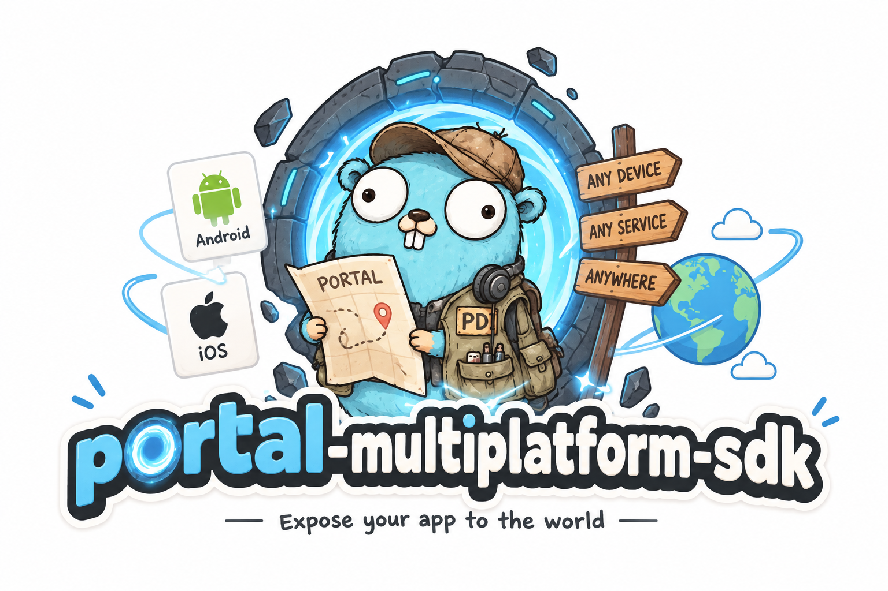
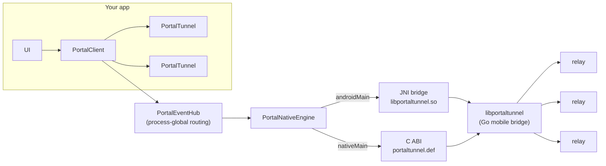

<p align="center">
  
</p>

<h1 align="center">Portal Multiplatform SDK</h1>

<p align="center">
  Expose local services and static sites from <b>Android</b> and <b>iOS</b> app
  processes through <a href="https://github.com/gosuda/portal-tunnel">Portal</a>
  relays — one Kotlin API, every platform.
</p>

<p align="center">
  <a href="https://github.com/gosuda/portal-multiplatform-sdk/actions"></a>
  
  
  <a href="LICENSE"></a>
</p>

---

## What you can build with it


Portal turns an app process into a public endpoint — no server, no public IP,
no port forwarding. Concrete things people build on it:

- **Mobile-hosted web apps** — serve a full static site or HTTP API straight
  from the app (the sample does exactly this: `kmp-sample.portal.damn.it.com`).
- **Game servers on a phone** — expose a UDP or TCP listener for multiplayer
  sessions, co-op lobbies, or LAN-style play over the internet.
- **Webhooks & callbacks on-device** — receive push-style HTTP callbacks in an
  app without a backend relay of your own.
- **Dev tunnels** — point a public URL at a dev build running on a phone for
  demos, QA, or sharing work-in-progress.
- **Paid endpoints** — gate routes behind x402 micropayments (Sui USDC,
  Casper wCSPR) with per-route pricing.
- **Private-by-default exposure** — ECH hides the hostname, `hide=true`
  unlists the endpoint, and MITM self-probing flags suspicious relays.

## What it does
static site, a raw TCP/UDP socket — through public relays, without a server or
a public IP. This SDK wraps the shared `libportaltunnel` engine in a single
Kotlin Multiplatform API:

- **One `PortalConfig`** drives HTTP/TLS sites, static directories, raw TCP
  and UDP, ECH privacy, relay discovery, and x402 micropayments.
- **`StateFlow` snapshots** are the authoritative state; events are auxiliary
  notifications, never the source of truth.
- **Structured failures** (`PortalFailure` codes) instead of raw native error
  codes; cancellation is always `CancellationException`, never wrapped.
- **Ownership is explicit**: a `PortalClient` owns its sessions, `close()`
  stops exactly those, and a process-global event hub routes native callbacks
  to the right owner.

## Architecture



| Layer | Where | Contract |
|---|---|---|
| `PortalClient` / `PortalTunnel` | `commonMain` | snapshots, events, failures, ownership |
| `PortalEventHub` | `commonMain` | one global callback → per-owner routing |
| `PortalNativeEngine` | `commonMain` expect | raw string/JSON ABI seam |
| JNI bridge | `portal-native-android` | `org.gosuda.portal.android.internal.NativeBridge` |
| cinterop | `nativeMain` | `portaltunnel.def` → `native/include/portaltunnel.h` |
| Swift facade | `iosMain` | `PortalIosClient`/`PortalIosSession` callbacks |

## Platform matrix

| Target | Status | Native engine |
|---|---|---|
| `android` (arm64-v8a, x86_64) | ✅ shipped | prebuilt `libportaltunnel.so`, 16 KB-page aligned |
| `iosArm64` / `iosSimulatorArm64` / `iosX64` | ✅ verified | `libportaltunnel.a` built from `native/bridge` via `scripts/build-ios-engine.sh` — see [native/README.md](native/README.md) |
| `linuxX64` | 🧪 experimental | C stub for tests; link the real `.so` for production |

## Install

```kotlin
// settings.gradle.kts — include the modules in your build, or consume the
// published coordinates once a release is cut.
implementation("io.github.gosuda:portal-sdk:0.1.0")
```

iOS additionally needs the `PortalSDK` XCFramework plus `libportaltunnel.a`
linked into the app target — see [samples/ios/README.md](samples/ios/README.md).
The engine archive is rebuilt from `native/bridge` (clean-room Go bridge over
portal-tunnel v2.4.3 `sdk.Exposure`) and is gitignored.

## Quick start

### Kotlin (Android / common)

```kotlin
val client = PortalClient()

val tunnel = client.open(
    PortalConfig(
        name = "my-site",
        staticDir = "/data/app/site",
        staticIndex = "index.html",
        discovery = true
    )
)

// Authoritative state — render this.
tunnel.state.collect { snapshot ->
    println("${snapshot.phase} ${snapshot.primaryPublicUrl}")
}

// Or suspend until a capability is confirmed ready.
val ready = tunnel.awaitReady(Capability.STATIC_SITE)
// or: tunnel.awaitActive(15_000)

tunnel.stop()      // retryable on native failure
client.close()     // stops only the sessions this client owns
```

### Swift (iOS)

```swift
let client = PortalIosClient()
client.open(config: config) { session, failure in
    guard let session else { showError(failure); return }
    session.observeState { snapshot in render(snapshot) }
}
```

See [samples/android](samples/android) for a complete Compose app and
[samples/ios](samples/ios) for the SwiftUI equivalent.

## Usage

### Configuration

`PortalConfig` is the single input. Common shapes:

```kotlin
// Static site (the sample)
PortalConfig(name = "site", staticDir = dir, staticIndex = "index.html")

// Proxy a local HTTP server
PortalConfig(name = "api", targetAddr = "127.0.0.1:8080")

// Raw UDP / TCP listener
PortalConfig(name = "game", udp = true, udpAddr = "127.0.0.1:7777")
PortalConfig(name = "tcp",  tcp = true)

// Discovery off, explicit relays only
PortalConfig(name = "x", discovery = false,
             relays = listOf("https://portal.example.com"))

// Paid route (x402)
PortalConfig(
    name = "paid",
    httpRoutes = listOf(
        PortalHTTPRoute(prefix = "/premium", upstream = "http://127.0.0.1:8080",
                        amount = "0.01")
    ),
    x402 = PortalX402Config(payTo = "0x…", network = "sui", asset = "USDC")
)
```

Key rules: `identity_json` XOR `identity_path`; `discovery=false` needs ≥1
relay; relays are `https`-only (`http` allowed for loopback); targets are
loopback-only unless `PortalClient(allowRemoteTargets = true)`.

### Lifecycle & ownership

- One `PortalClient` per app (or long-lived component). It owns every
  `PortalTunnel` it opens.
- `client.close()` stops exactly the sessions it owns — never another
  client's. Safe to call twice; concurrent calls serialize.
- `tunnel.stop()` is idempotent and retryable: a native failure leaves the
  session in `STOPPING`, not `STOPPED`.
- Cancelling `open` rolls the native handle back — no orphaned sessions.

### Observing state

```kotlin
// Authoritative snapshot — render this in UI.
tunnel.state.collect { snap ->
    snap.phase               // IDLE → STARTING → CONNECTING → ACTIVE → …
    snap.primaryPublicUrl    // first public URL, if any
    snap.relays              // per-relay state/failure/error
    snap.hasSecurityWarning  // sticky MITM flag
    snap.isActive / isTerminal
}

// Auxiliary events (bounded, not replayed).
tunnel.events.collect { event -> /* Started / StatusChanged / … */ }

// Aggregate stream across all sessions this client owns.
client.events.collect { event -> … }

// Live session list (open order).
client.sessions.collect { list -> … }
```

### Live updates without restart

```kotlin
tunnel.updateMetadata(PortalMetadata(description = "new", tags = listOf("x")))
tunnel.addRelay("https://portal.example.com")
tunnel.removeRelay("https://portal.example.com")
tunnel.refresh()   // pull authoritative native status now
```

### Identity

```kotlin
val identity = PortalIdentity.generate("my-app")   // native-generated keys
val restored = PortalIdentity.parse(savedJson)      // validate + redacted toString
config = PortalConfig(identityJson = identity.document, ...)
// or let the engine persist one:
PortalConfig(identityPath = File(filesDir, "identity.json").absolutePath, ...)
```

`PortalIdentity.document` contains key material — redacted from `toString`;
store it in Keystore-wrapped storage / Keychain, never log it.

### Kotlin DSL + Android Context

```kotlin
val config = portalConfig {
    setName("site"); setDiscovery(true); setUdp(true)
}

// Android: defaults identity_path to filesDir/identity.json
val client = PortalClient(context)
```

### Android: surviving background & rotation

`portal-android-lifecycle` keeps a tunnel alive past the screen:

```kotlin
// Application.onCreate
PortalClientHolder.init()

// Foreground service for tunnels that must run while backgrounded
class TunnelService : PortalTunnelService() {
    override fun buildNotification(): Notification = …
}
// manifest: <service android:name=".TunnelService"
//   android:foregroundServiceType="dataSync"/>
```

### Diagnostics

```kotlin
val d = client.diagnostics()
// d.sdkVersion, d.abiVersion, d.activeSessions, d.droppedOrphanEvents,
// d.droppedAggregateEvents, d.sessions[]
```


## Design rules (the short version)

- `identity_json` XOR `identity_path`; `discovery=false` requires ≥1 relay.
- Relay URLs are `https` only — bare hosts default to `https`, `http` is
  accepted only for loopback (the engine upgrades it). Mirrors
  `utils.NormalizeRelayURL` in portal-tunnel.
- `target_addr`/`udp_addr` are loopback-only unless `allowRemoteTargets`.
- `hide=true` hides the listing; it is not access control. MITM suspicion is a
  sticky `hasSecurityWarning`, not proof of compromise.
- `overlay` is not in the v1 capability set → `UNSUPPORTED_CAPABILITY`.

Full contract: [docs/DESIGN_RULES.md](docs/DESIGN_RULES.md) ·
Troubleshooting: [docs/TROUBLESHOOTING.md](docs/TROUBLESHOOTING.md) ·
Known gaps & release gates: [TASKS.md](TASKS.md),
[native/source-lock.json](native/source-lock.json).

## Updating the native engine

The bundled `libportaltunnel.so` comes from
[gosuda/portal-tunnel](https://github.com/gosuda/portal-tunnel) releases.
To sync to a new release:

```bash
./scripts/sync-portal-tunnel.sh          # latest
./scripts/sync-portal-tunnel.sh v1.2.3   # specific tag
```

The script downloads the Android ABI artifacts, swaps them into
`portal-native-android/src/main/jniLibs/`, and updates `portal-tunnel.version`.
Rebuild and run the ABI smoke test after syncing.

## Repository layout

```
portal-sdk/               KMP library (commonMain / androidMain / nativeMain / iosMain)
portal-native-android/    JNI bridge + prebuilt libportaltunnel.so
portal-android-lifecycle/ Process-scoped client + foreground-service base
native/                   portaltunnel.h, C test stub, source provenance
samples/android/          Compose sample (config, identity, relays, events, diagnostics)
                          — see samples/android/README.md for the on-device model API
samples/ios/              SwiftUI sample + XCFramework instructions
docs/                     DESIGN_RULES, TROUBLESHOOTING, WORK_CHECKPOINT
.agents/skills/           agent skill: API reference, examples, troubleshooting
```

## Contributing

See [CONTRIBUTING.md](CONTRIBUTING.md). In short: `./gradlew build` must stay
green, commits follow `type(scope): subject`, and CI runs on `release-*` tags
or manual dispatch.

## License

Apache-2.0 — see [LICENSE](LICENSE).
