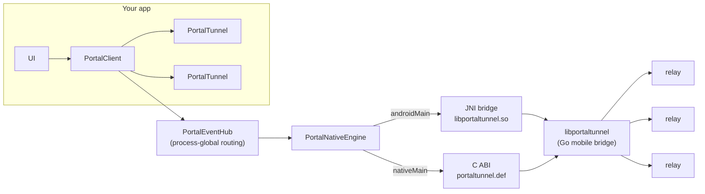

<p align="center">
  
</p>

<h1 align="center">Portal Multiplatform SDK</h1>

<p align="center">
  Expose local services and static sites from <b>Android</b> and <b>iOS</b> app
  processes through <a href="https://github.com/gosuda/portal-tunnel">Portal</a>
  relays — one Kotlin API, every platform.
</p>

<p align="center">
  <a href="https://github.com/kimmandoo/portal-multiplatform-sdk/actions"></a>
  
  
  <a href="LICENSE"></a>
</p>

---

## What it does

Portal lets a phone app publish a reachable endpoint — a local HTTP server, a
static site, a raw TCP/UDP socket — through public relays, without a server or
a public IP. This SDK wraps the shared `libportaltunnel` engine in a single
Kotlin Multiplatform API:

- **One `PortalConfig`** drives HTTP/TLS sites, static directories, raw TCP
  and UDP, ECH privacy, relay discovery, and x402 micropayments.
- **`StateFlow` snapshots** are the authoritative state; events are auxiliary
  notifications, never the source of truth.
- **Structured failures** (`PortalFailure` codes) instead of raw native error
  codes; cancellation is always `CancellationException`, never wrapped.
- **Ownership is explicit**: a `PortalClient` owns its sessions, `close()`
  stops exactly those, and a process-global event hub routes native callbacks
  to the right owner.

## Architecture



| Layer | Where | Contract |
|---|---|---|
| `PortalClient` / `PortalTunnel` | `commonMain` | snapshots, events, failures, ownership |
| `PortalEventHub` | `commonMain` | one global callback → per-owner routing |
| `PortalNativeEngine` | `commonMain` expect | raw string/JSON ABI seam |
| JNI bridge | `portal-native-android` | `org.gosuda.portal.android.internal.NativeBridge` |
| cinterop | `nativeMain` | `portaltunnel.def` → `native/include/portaltunnel.h` |
| Swift facade | `iosMain` | `PortalIosClient`/`PortalIosSession` callbacks |

## Platform matrix

| Target | Status | Native engine |
|---|---|---|
| `android` (arm64-v8a, x86_64) | ✅ shipped | prebuilt `libportaltunnel.so`, 16 KB-page aligned |
| `iosArm64` / `iosSimulatorArm64` / `iosX64` | ⚠️ compile-only | link `libportaltunnel.a` yourself — see [native/README.md](native/README.md) |
| `linuxX64` | 🧪 experimental | C stub for tests; link the real `.so` for production |

## Install

```kotlin
// settings.gradle.kts — include the modules in your build, or consume the
// published coordinates once a release is cut.
implementation("io.github.kimmandoo:portal-sdk:0.1.0")
```

iOS additionally needs the `PortalSDK` XCFramework plus `libportaltunnel.a`
linked into the app target — see [samples/ios/README.md](samples/ios/README.md).

## Quick start

### Kotlin (Android / common)

```kotlin
val client = PortalClient()

val tunnel = client.open(
    PortalConfig(
        name = "my-site",
        staticDir = "/data/app/site",
        staticIndex = "index.html",
        discovery = true
    )
)

// Authoritative state — render this.
tunnel.state.collect { snapshot ->
    println("${snapshot.phase} ${snapshot.primaryPublicUrl}")
}

// Or suspend until a capability is confirmed ready.
val ready = tunnel.awaitReady(Capability.STATIC_SITE)

tunnel.stop()      // retryable on native failure
client.close()     // stops only the sessions this client owns
```

### Swift (iOS)

```swift
let client = PortalIosClient()
client.open(config: config) { session, failure in
    guard let session else { showError(failure); return }
    session.observeState { snapshot in render(snapshot) }
}
```

See [samples/android](samples/android) for a complete Activity and
[samples/ios](samples/ios) for a SwiftUI sketch.

## Identity

```kotlin
val identity = PortalIdentity.generate("my-app")   // native-generated keys
val restored = PortalIdentity.parse(savedJson)      // validate + redacted toString
config = PortalConfig(identityJson = identity.document, ...)
```

`PortalIdentity.document` contains key material — it is redacted from
`toString`; store it in Keystore-wrapped storage / Keychain, never log it.

## Design rules (the short version)

- `identity_json` XOR `identity_path`; `discovery=false` requires ≥1 relay.
- Relay URLs are `https` only — bare hosts default to `https`, `http` is
  accepted only for loopback (the engine upgrades it). Mirrors
  `utils.NormalizeRelayURL` in portal-tunnel.
- `target_addr`/`udp_addr` are loopback-only unless `allowRemoteTargets`.
- `hide=true` hides the listing; it is not access control. MITM suspicion is a
  sticky `hasSecurityWarning`, not proof of compromise.
- `overlay` is not in the v1 capability set → `UNSUPPORTED_CAPABILITY`.

Full contract: [docs/DESIGN_RULES.md](docs/DESIGN_RULES.md) ·
Troubleshooting: [docs/TROUBLESHOOTING.md](docs/TROUBLESHOOTING.md) ·
Known gaps & release gates: [TASKS.md](TASKS.md),
[native/source-lock.json](native/source-lock.json).

## Repository layout

```
portal-sdk/               KMP library (commonMain / androidMain / nativeMain / iosMain)
portal-native-android/    JNI bridge + prebuilt libportaltunnel.so
native/                   portaltunnel.h, C test stub, source provenance
samples/android/          minimal Activity sample
samples/ios/              SwiftUI sketch + XCFramework instructions
docs/                     DESIGN_RULES, TROUBLESHOOTING, WORK_CHECKPOINT
.agents/skills/           agent skill: API reference, examples, troubleshooting
```

## Contributing

See [CONTRIBUTING.md](CONTRIBUTING.md). In short: `./gradlew build` must stay
green, commits follow `type(scope): subject`, and CI runs on `release-*` tags
or manual dispatch.

## License

Apache-2.0 — see [LICENSE](LICENSE).
